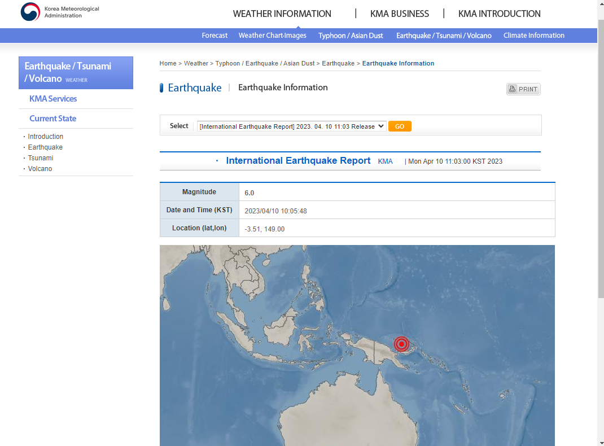

지진 정보 제공 웹사이트 !
============================================================================================

by: Odonkhuu Zolboo  
20208008

개발배경
====

### 지진 정보 제공 웹사이트의 사용성 문제:

*   많은 정보!
*   관련 정보를 빠르게 찾기 어려움!
*   혼잡한 인터페이스

#### United States Geological Survey : Home Page

#### Earthquake Page

#### Japan Meteorological Agency : Home Page

#### Earthquake Page

#### Korea Meteorological Administration

개발 내용 요점
========

입력에 대한 요구 내용 또는 설명
------------------

*   최신 지진 정보 및 과거 지진 데이터
    *   지진 위치, 규모, 날짜/시간 지도 등
*   교육 자료, FAQ, Useful 링크s
    *   기사, 비디오, 인포그래픽, 인터랙티브 도구 등
*   연락처 및 문의 내용

결과물에 대한 요구 설명:
--------------

*   Better UX!
*   Responsive Design
*   정확하고 최신의 지진 정보 제공

#### Website Map

.

###### 구현 결과- 메인화면

.

###### 구현 결과- 지진 정보

thank you for your attention!

